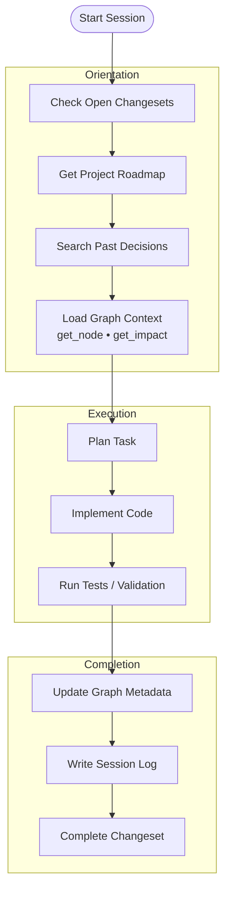
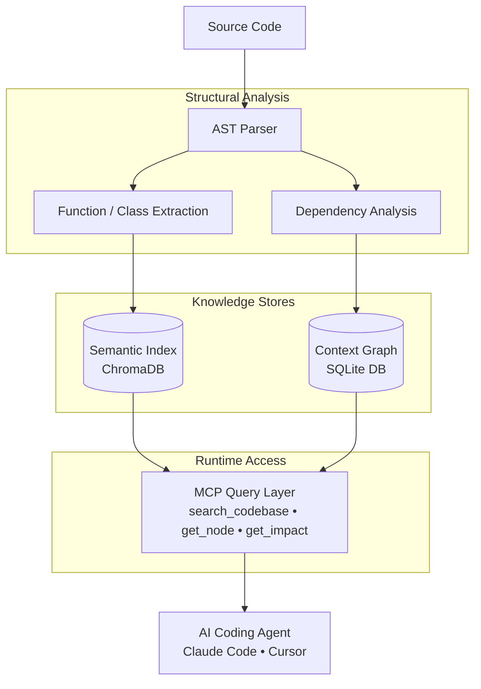

# Codevira MCP

> Persistent memory and project context for AI coding agents — across every session, every tool, every file.

[](https://www.python.org/)
[](LICENSE)
[](https://modelcontextprotocol.io)
[](CHANGELOG.md)
[](CONTRIBUTING.md)
[](CONTRIBUTING.md)

**Works with:** Claude Code · Cursor · Windsurf · Google Antigravity · any MCP-compatible AI tool

---

## The Problem

Every time you start a new AI coding session, your agent starts from zero.

It re-reads files it has seen before. It re-discovers patterns already established. It makes decisions that contradict last week's decisions. It has no idea what phase the project is in, what's already been tried, or why certain files are off-limits.

You end up spending thousands of tokens on re-discovery — every single session.

**Codevira fixes this.**

---

## What It Does

Codevira is a [Model Context Protocol](https://modelcontextprotocol.io) server you drop into any project. It gives every AI agent that works on your codebase a shared, persistent memory:

| Capability | What It Means |
|---|---|
| **Live auto-watch** | Background file watcher auto-reindexes on every save — no manual trigger or git commit needed |
| **Context graph** | Every source file has a node: role, rules, dependencies, stability, `do_not_revert` flags |
| **Semantic code search** | Natural language search across your codebase — no grep, no file reading |
| **Roadmap** | Phase-based tracker so agents always know what phase you're in and what comes next |
| **Changeset tracking** | Multi-file changes tracked atomically; sessions resume cleanly after interruption |
| **Decision log** | Every session writes a structured log; past decisions are searchable by any future agent |
| **Agent personas** | Seven role definitions (Planner, Developer, Reviewer, Tester, Builder, Documenter, Orchestrator) with explicit protocols |

**The result:** ~1,400 tokens of overhead per session instead of 15,000+ tokens of re-discovery.

---

## How It Works

## Agent Session Lifecycle



---


### Code Intelligence Model




## Quick Start

### 1. Install

```bash
pip install codevira-mcp
```

### 2. Initialize in your project

```bash
cd your-project
codevira init
```

This single command:
- Creates `.codevira/` with config, graph, and log directories
- Adds `.codevira/` to `.gitignore` (index is auto-regenerated, no need to commit)
- Prompts for project name, language, source directories (comma-separated), and file extensions
- Builds the full code index using SHA-256 content hashing (only changed files are re-indexed)
- Auto-generates graph stubs for all source files
- Bootstraps `.codevira/roadmap.yaml` from git history
- Installs a `post-commit` git hook for automatic reindexing
- Prints the MCP config block to paste into your AI tool

> **Live Auto-Watch:** When the MCP server starts, it automatically launches a background file watcher. Every time you save a source file, the index is updated within 2 seconds — no manual commands needed. The `post-commit` hook and `codevira index` CLI remain available as alternatives.

### 3. Connect to your AI tool

Depending on your IDE and environment, `codevira-mcp` may not automatically be in your `PATH`.
You can use `uvx` (the easiest option) or provide the absolute path to your Python virtual environment.

**Option A: Using uvx (Recommended for all IDEs without local install)**
If you use [`uv`](https://github.com/astral-sh/uv), you can run the MCP server seamlessly without managing virtual environments per project.

**Claude Code** (`.claude/settings.json`), **Cursor / Windsurf** (Settings → MCP):
```json
{
  "mcpServers": {
    "codevira": {
      "command": "uvx",
      "args": ["codevira-mcp", "--project-dir", "/path/to/your-project"]
    }
  }
}
```

**Option B: Using Local Venv (Recommended, works everywhere)**
Point your AI tool directly to the Python runtime inside your `.venv` where `codevira-mcp` is installed. 

**Claude Code** (`.claude/settings.json`) or **Cursor / Windsurf** (Settings → MCP):
```json
{
  "mcpServers": {
    "codevira": {
      "command": "/path/to/your-project/.venv/bin/python",
      "args": ["-m", "mcp_server", "--project-dir", "/path/to/your-project"]
    }
  }
}
```

**Google Antigravity** — add to `~/.gemini/antigravity/mcp_config.json`:
```json
{
  "mcpServers": {
    "codevira": {
      "$typeName": "exa.cascade_plugins_pb.CascadePluginCommandTemplate",
      "command": "/path/to/your-project/.venv/bin/python",
      "args": ["-m", "mcp_server", "--project-dir", "/path/to/your-project"]
    }
  }
}
```

> **⚠️ IMPORTANT: Using Global Clients (Antigravity / Claude Desktop) with Multiple Projects**
> 
> Unlike Cursor, which spins up isolated MCP servers per project automatically, global clients like Antigravity share a single `mcp_config.json` across all your open projects.
> 
> If you configure `codevira` once for `Project A`, and then ask a question about `Project B`, the agent will read the graph and roadmap from `Project A`.
> 
> **To fix this:** You must register uniquely named servers for each project in your global config. The AI will dynamically choose the right tool prefix based on your conversation context:
> ```json
> {
>   "mcpServers": {
>     "codevira-project-a": {
>       "$typeName": "exa.cascade_plugins_pb.CascadePluginCommandTemplate",
>       "command": "uvx",
>       "args": ["codevira-mcp", "--project-dir", "/path/to/project-a"]
>     },
>     "codevira-project-b": {
>       "$typeName": "exa.cascade_plugins_pb.CascadePluginCommandTemplate",
>       "command": "uvx",
>       "args": ["codevira-mcp", "--project-dir", "/path/to/project-b"]
>     }
>   }
> }
> ```

### 4. Verify

Ask your agent to call `get_roadmap()` — it should return your current phase and next action.

### Project structure after init

```
your-project/
├── src/                   ← your code (indexed)
├── .codevira/             ← Codevira data directory (git-ignored)
│   ├── config.yaml        ← project configuration
│   ├── roadmap.yaml       ← project roadmap (auto-generated, human-enrichable)
│   ├── codeindex/         ← ChromaDB index (auto-regenerated)
│   └── graph/             ← context graph and session memory
│       ├── graph.db       ← SQLite database for nodes, edges, logs, and decisions
│       └── changesets/    ← active multi-file change records
└── requirements.txt       ← add: codevira-mcp>=1.0.0
```

> **Roadmap lifecycle:** The roadmap is auto-generated during init and updated by the agent through MCP tool calls. See [docs/roadmap.md](docs/roadmap.md) for the full lifecycle guide, manual editing steps, and troubleshooting.

---

## Session Protocol

Every agent session follows a simple protocol. Set it up once in your agent's system prompt — then your agents handle the rest.

**Session start (mandatory):**
```
list_open_changesets()      → resume any unfinished work first
get_roadmap()               → current phase, next action
search_decisions("topic")   → check what's already been decided
get_node("src/service.py")  → read rules before touching a file
get_impact("src/service.py") → check blast radius
```

**Session end (mandatory):**
```
complete_changeset(id, decisions=[...])
update_node(file_path, changes)
update_next_action("what the next agent should do")
write_session_log(...)
```

This loop keeps every session fast, focused, and resumable.

---

## 26 MCP Tools

### Graph Tools
| Tool | Description |
|---|---|
| `get_node(file_path)` | Metadata, rules, connections, staleness for any file |
| `get_impact(file_path)` | BFS blast-radius — which files depend on this one |
| `list_nodes(layer?, stability?, do_not_revert?)` | Query nodes by attribute |
| `add_node(file_path, role, type, ...)` | Register a new file in the graph |
| `update_node(file_path, changes)` | Append rules, connections, key_functions |
| `refresh_graph(file_paths?)` | Auto-generate stubs for unregistered files |
| `refresh_index(file_paths?)` | Re-embed specific files in ChromaDB |

### Roadmap Tools
| Tool | Description |
|---|---|
| `get_roadmap()` | Current phase, next action, open changesets |
| `get_full_roadmap()` | Complete history: all phases, decisions, deferred |
| `get_phase(number)` | Full details of any phase by number |
| `update_next_action(text)` | Set what the next agent should do |
| `update_phase_status(status)` | Mark phase in_progress / blocked |
| `add_phase(phase, name, description, ...)` | Queue new upcoming work |
| `complete_phase(number, key_decisions)` | Mark done, auto-advance to next |
| `defer_phase(number, reason)` | Move a phase to the deferred list |

### Changeset Tools
| Tool | Description |
|---|---|
| `list_open_changesets()` | All in-progress changesets |
| `get_changeset(id)` | Full detail: files done, files pending, blocker |
| `start_changeset(id, description, files)` | Open a multi-file changeset |
| `complete_changeset(id, decisions)` | Close and record decisions |
| `update_changeset_progress(id, last_file, blocker?)` | Mid-session checkpoint |

### Search Tools
| Tool | Description |
|---|---|
| `search_codebase(description, top_k?)` | Semantic search over source code |
| `search_decisions(query, limit?, session_id?)` | Search all past session decisions; optionally filter to a specific session |
| `get_history(file_path)` | All sessions that touched a file |
| `write_session_log(...)` | Write structured session record |

### Code Reader Tools
| Tool | Description |
|---|---|
| `get_signature(file_path)` | All public symbols, signatures, line numbers |
| `get_code(file_path, symbol)` | Full source of one function or class |

### Playbook Tool
| Tool | Description |
|---|---|
| `get_playbook(task_type)` | Curated rules for a task: `add_route`, `add_service`, `add_schema`, `debug_pipeline`, `commit`, `write_test` |

---

## Agent Personas

Seven role definitions in `agents/` tell each agent exactly what to do and when:

| Agent | Invoked When | Key Responsibility |
|---|---|---|
| `orchestrator.md` | Every session start | Classify task, select pipeline |
| `planner.md` | Large or ambiguous tasks | Decompose into ordered steps |
| `developer.md` | All code changes | Write code within graph rules |
| `reviewer.md` | `stability: high` or `do_not_revert` files | Flag rule violations |
| `tester.md` | After every code change | Run the test suite |
| `builder.md` | After tests pass | Lint, type-check |
| `documenter.md` | End of every session | Update graph, roadmap, log |

---

## Project Structure

```
.agents/
├── PROTOCOL.md              # Session protocol — read this first
├── config.example.yaml      # Config template
├── config.yaml              # Your config (git-ignored)
├── roadmap.yaml             # Phase tracker (auto-created, git-ignored)
├── mcp-server/
│   ├── server.py            # MCP server entry point
│   └── tools/
│       ├── graph.py
│       ├── roadmap.py
│       ├── changesets.py
│       ├── search.py
│       ├── playbook.py
│       └── code_reader.py
├── indexer/
│   ├── index_codebase.py    # Build/update ChromaDB index + background file watcher
│   ├── chunker.py           # AST-based code chunker
│   ├── treesitter_parser.py # Multi-language AST parsing (16+ languages)
│   ├── sqlite_graph.py      # SQLite graph database backend
│   └── graph_generator.py   # Auto-generate graph stubs
├── requirements.txt         # Python dependencies
├── agents/                  # Role definitions
│   ├── orchestrator.md
│   ├── planner.md
│   ├── developer.md
│   ├── reviewer.md
│   ├── tester.md
│   ├── builder.md
│   └── documenter.md
├── rules/                   # Engineering standards
│   ├── master_rule.md
│   ├── coding-standards.md
│   ├── testing-standards.md
│   └── ...13 more
├── graph/
│   ├── graph.db             # SQLite Context Graph and Session Memory (git-ignored)
│   └── changesets/
├── hooks/
│   └── install-hooks.sh
└── codeindex/               # ChromaDB files (git-ignored)
```

---

## Language Support

| Feature | Python | TypeScript | Go | Rust | 10+ Others (Java, C#, Ruby, PHP, C++) |
|---|---|---|---|---|---|
| Semantic code search | ✅ | ✅ | ✅ | ✅ | ✅ |
| Context graph + blast radius | ✅ | ✅ | ✅ | ✅ | ✅ |
| Roadmap + changesets | ✅ | ✅ | ✅ | ✅ | ✅ |
| Session logs + decision search | ✅ | ✅ | ✅ | ✅ | ✅ |
| `get_signature` / `get_code` | ✅ | ✅ | ✅ | ✅ | |
| Auto-generated graph stubs | ✅ | ✅ | ✅ | ✅ | |
| AST-based chunking | ✅ | ✅ | ✅ | ✅ | |

All session management, graph, roadmap, and search features work for any language. Code parsing and extraction (search, graph generation, signature reads) are powered by robust ast and Tree-Sitter integrations.

---

## Requirements

- Python 3.10+
- ChromaDB
- sentence-transformers
- PyYAML

```bash
pip install -r .agents/requirements.txt
```

---

## Background

Want to understand the full story behind why this was built, the design decisions, what didn't work, and how it compares to other tools in the ecosystem?

Read the full write-up: [How We Cut AI Coding Agent Token Usage by 92%](docs/how-i-built-persistent-memory-for-ai-agents.md)

---

## Contributing

Contributions are welcome — this is an early-stage open source project and there's a lot of room to grow.

Read [CONTRIBUTING.md](CONTRIBUTING.md) for the full guide: forking, branch naming, commit format, and PR process.

**Good first areas:**
- Graph visualization exports (Dot/Mermaid)
- Additional playbook entries for common task types
- IDE-specific setup guides
- Bug reports and edge case fixes

**Reporting a bug?** → [Open a bug report](https://github.com/sachinshelke/codevira/issues/new?template=bug_report.md)

**Requesting a feature?** → [Open a feature request](https://github.com/sachinshelke/codevira/issues/new?template=feature_request.md)

**Found a security issue?** → Read [SECURITY.md](SECURITY.md) — please don't use public issues for vulnerabilities.

Please open an issue before submitting a large PR so we can discuss the approach first.

---

## FAQ

Common questions about setup, usage, architecture, and troubleshooting — see [FAQ.md](FAQ.md).

---

## Roadmap

See what's built, what's coming next, and what's being considered — see [ROADMAP.md](ROADMAP.md).

Want to influence priorities? [Open a feature request](https://github.com/sachinshelke/codevira/issues/new?template=feature_request.md) or upvote existing ones.

---

## Code of Conduct

This project follows the [Contributor Covenant Code of Conduct](CODE_OF_CONDUCT.md).
By participating, you agree to maintain a respectful and welcoming environment.

---

## License

MIT — free to use, modify, and distribute.
