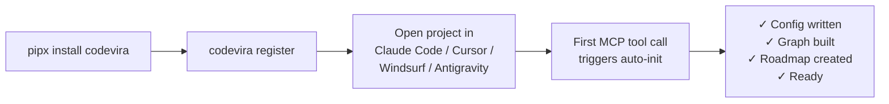
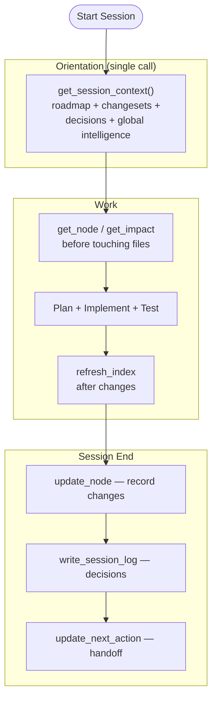
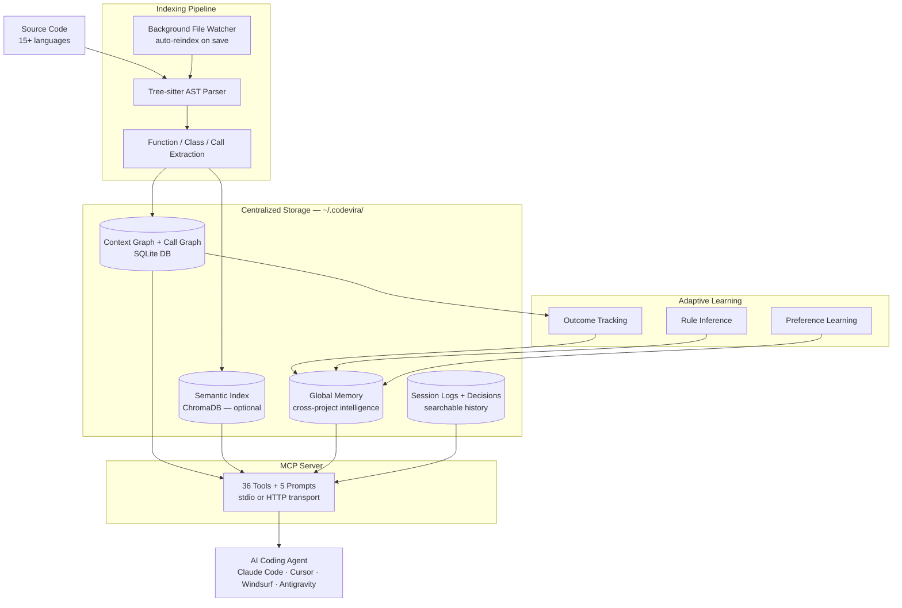

# Codevira

> **One memory layer for every AI coding tool you use.** Switch between Claude Code, Cursor, Windsurf, and Antigravity without losing context, decisions, or progress.

[](https://pypi.org/project/codevira/)
[](https://pypi.org/project/codevira/)
[](https://pepy.tech/project/codevira)
[](LICENSE)
[](https://modelcontextprotocol.io)
[](CONTRIBUTING.md)

**Built for solo developers** working on local projects with AI agents. Codevira gives every AI tool you use access to the same persistent project memory — so you stop re-explaining your codebase every session, stop losing carefully-made decisions, and stop burning tokens on re-discovery.

**Works with:** Claude Code · Claude Desktop · Cursor · Windsurf · Google Antigravity · any MCP-compatible AI tool

---

## The Problem (Four Pains Codevira Solves)

If you code with AI agents on a project longer than a week, you've felt all of these:

### 1. Re-explaining your codebase every session
Every new chat starts from zero. The AI doesn't know your architecture, your conventions, your "we don't do it that way" decisions. You waste the first 10 minutes (and thousands of tokens) catching it up — only to do it again tomorrow.

### 2. AI undoing your careful decisions
Last week you debugged a tricky retry policy for 3 hours. Today's AI session refactors it to a simpler version because it has no idea why the complexity exists. Now it's broken again.

### 3. Cross-tool amnesia
You started planning in Claude Code. Switched to Cursor for autocomplete. Opened Antigravity to run tests. Three different agents, three different blind copies of your project state. Nothing carries over.

### 4. Token budget burned on re-discovery
Your AI agent reads the same 12 files every session before doing any actual work. You're paying API costs for the same lookups, over and over.

**Codevira is a persistent memory layer that fixes all four — for every AI tool, on every project, on your local machine.**

---

## How It Works

Codevira is a [Model Context Protocol](https://modelcontextprotocol.io) server that runs locally and gives any AI tool a structured, queryable memory of your codebase:

| Capability | What it means for you |
|---|---|
| **Zero-config setup** | `pipx install codevira && codevira register` — that's it. No prompts, no JSON editing. Auto-detects language, source dirs, and IDE configs |
| **Cross-tool continuity** | One `get_session_context()` call brings any AI agent up to speed in ~800 tokens — works identically in Claude Code, Cursor, Windsurf, Antigravity |
| **Decision protection** | `do_not_revert` flags + searchable decision log stop AI agents from undoing past architectural choices |
| **Context graph** | Every source file has a node: role, rules, dependencies, stability, blast radius. AI calls `get_node(path)` instead of re-reading the file |
| **Function-level call graph** | `get_impact(file)` answers "what breaks if I change this?" before the AI modifies anything |
| **Semantic code search** | Natural-language search across your codebase (`search_codebase("auth flow")`) |
| **Roadmap + changesets** | Multi-file work tracked atomically; sessions resume cleanly after interruption |
| **Adaptive learning** | Tracks which past decisions panned out — gives confidence scores and surfaces patterns |
| **Cross-project memory** | Learned preferences sync across all your local projects via `~/.codevira/global.db` |
| **Auto-init on first call** | No `codevira init` needed — first MCP tool call triggers background project setup |

### Token-efficient by design

Codevira is built around the principle that AI agent context windows are precious. Tools return **summaries by default** with opt-in full data:

- `get_node(path)` — ~100 tokens by default (counts + flags). Pass `full=true` for the entire rules array.
- `get_impact(path)` — 10 affected files. Pass `summary_only=true` for just counts (~80 tokens) before deciding to dig deeper.
- `search_codebase(query)` — file/symbol pointers only. Pass `include_content=true` to inline source.
- `search_decisions(query)` — 5 truncated matches. Pass `full=true` for verbatim text.

The agent always asks for what it needs, in the size it needs.

---

## Quick Start

### 1. Install

```bash
# Recommended: global install via pipx (isolated, works everywhere)
pipx install codevira

# Alternative: pip install
pip install codevira
```

Installs the full toolkit (23 AI-facing MCP tools + 12 admin/CLI tools) out of the box. Semantic search downloads a ~90MB embedding model on first use.

### 2. Register with your AI tools

```bash
codevira register
```

This one-time global command injects Codevira's MCP config into all detected AI tools — Claude Code, Cursor, Windsurf, Claude Desktop, and Google Antigravity. Run it from anywhere; no project directory needed.

### 3. Start using

Open any project in your AI tool. On the first MCP tool call, Codevira **auto-initializes**:
- Detects language, source directories, and file extensions from project markers
- Creates the context graph and roadmap
- Installs a `post-commit` git hook for automatic reindexing

No explicit `codevira init` needed — everything happens on demand.

> **Note:** `codevira init` is still available for explicit per-project setup with custom settings.

### 4. Verify

Ask your AI agent to call `get_roadmap()` — it should return your current phase and next action.

> **Note:** Restart your AI tool after running `codevira register` to pick up the new MCP config.

### Customizing what's indexed

Codevira tries to auto-detect your project's source layout, but monorepo or non-standard layouts sometimes slip through — you'll notice when `codevira index --full` reports `0 chunks indexed` and prints a hint pointing you here.

```bash
cd your-project
codevira configure
```

Scans your project (gitignore-aware), shows discovered directories and extensions with file counts, and lets you pick which to watch via a numbered-list prompt. It writes your choices back to `.codevira/config.yaml` and offers to rebuild the index.

**Non-interactive** (useful in scripts or CI):
```bash
codevira configure --dirs src,packages,apps --extensions .py,.ts,.tsx --no-reindex
```

After changing watched directories, **restart your AI tool** — running watchers snapshot the dir set at boot.

### Manual config (only if auto-inject didn't detect your tool)

Codevira supports two transports. Use the right one for your client:

| Client | Transport | Config file |
|--------|-----------|-------------|
| Claude Desktop (app) | stdio | `~/Library/Application Support/Claude/claude_desktop_config.json` |
| Claude Code (CLI) | stdio or HTTP | `.claude/settings.json` |
| Cursor | stdio | `.cursor/mcp.json` |
| Windsurf | stdio | `.windsurf/mcp.json` |
| Google Antigravity | stdio | `~/.gemini/antigravity/mcp_config.json` |

**Stdio transport** — Claude Desktop, Cursor, Windsurf (`.claude/settings.json` / `.cursor/mcp.json` / `.windsurf/mcp.json`):
```json
{
  "mcpServers": {
    "codevira": {
      "command": "codevira",
      "args": [],
      "cwd": "/path/to/your-project"
    }
  }
}
```

**Claude Desktop** (`~/Library/Application Support/Claude/claude_desktop_config.json`):
```json
{
  "mcpServers": {
    "codevira": {
      "command": "/path/to/codevira",
      "args": ["--project-dir", "/path/to/your-project"]
    }
  }
}
```

> Tip: find the full binary path with `which codevira`

**HTTP/HTTPS transport** — *Preview in v1.7, single-project only.* The HTTP server binds to one project at startup and cannot switch contexts per request. **Multi-project HTTPS is planned for v1.8.** For multi-project work today, use stdio via `codevira register` (above).

First start the HTTP server in a terminal:
```bash
codevira serve --port 7007 --project-dir /path/to/your-project
# For HTTPS (required by some clients):
codevira serve --https --port 7443 --project-dir /path/to/your-project
```

Then register the URL:
```json
{
  "mcpServers": {
    "codevira": {
      "url": "https://localhost:7443/mcp"
    }
  }
}
```

> **HTTPS note:** Claude Code uses Node.js, which requires a trusted CA for HTTPS.
> Run once to trust the mkcert CA:
> ```bash
> brew install mkcert && mkcert -install
> launchctl setenv NODE_EXTRA_CA_CERTS "$(mkcert -CAROOT)/rootCA.pem"
> echo 'export NODE_EXTRA_CA_CERTS="$(mkcert -CAROOT)/rootCA.pem"' >> ~/.zshrc
> ```
> Then restart Claude Code.

**Auto-start on login (macOS):**
```bash
codevira serve --install-service    # start server automatically on login
codevira serve --uninstall-service  # remove auto-start
```

**Google Antigravity** (`~/.gemini/antigravity/mcp_config.json`):
```json
{
  "mcpServers": {
    "codevira": {
      "$typeName": "exa.cascade_plugins_pb.CascadePluginCommandTemplate",
      "command": "codevira",
      "args": []
    }
  }
}
```

### Codevira data layout (v1.6)

```
~/.codevira/                         <- global Codevira home
├── global.db                        <- cross-project intelligence
├── projects/
│   └── <project-key>/               <- per-project data (keyed by path)
│       ├── config.yaml
│       ├── metadata.json
│       ├── graph/
│       │   ├── graph.db
│       │   └── changesets/
│       ├── codeindex/               <- semantic search (optional)
│       └── logs/
└── certs/                           <- HTTPS certs (if using --https)
```

> Legacy `.codevira/` directories inside project repos are auto-migrated to centralized storage on first server start.

### Configuration

Each project has a `config.yaml` at `~/.codevira/projects/<project-key>/config.yaml`. It's auto-generated on first use with sensible defaults, but you can edit it to customize what Codevira indexes:

```yaml
project:
  name: my-project
  language: python
  collection_name: my_project
  # Which directories to scan for source files
  watched_dirs:
    - src
    - tests
    - scripts
  # Which file extensions count as "source" for indexing + change detection
  file_extensions:
    - .py
    - .ts
    - .tsx
  # Directories to skip even if inside watched_dirs
  skip_dirs:
    - node_modules
    - .venv
    - __pycache__
    - dist
    - build
logs:
  # 0 = keep sessions/decisions forever (default).
  # Only set > 0 if you have privacy reasons to time-bound history.
  retention_days: 0
```

**Common gotchas:**

- `file_extensions` must be a proper YAML list — **each extension on its own line**. This is wrong:
  ```yaml
  file_extensions:
    - .py, .md, .html    # ❌ one item containing commas, not three extensions
  ```
  This is correct:
  ```yaml
  file_extensions:
    - .py
    - .md
    - .html
  ```
  Or inline:
  ```yaml
  file_extensions: [.py, .md, .html]
  ```

- `file_extensions` is intended for **source code** (Python, TypeScript, Go, Rust, etc.). Codevira uses tree-sitter AST parsing — putting `.md` or `.html` here may produce malformed graph nodes since tree-sitter parsers for those languages are different.

- Files are only scanned if they live inside `watched_dirs`. Adding an extension alone isn't enough — make sure the directory is listed too.

**After editing the config**, run `codevira index --full` to rebuild the graph from scratch, or `codevira index` for incremental changes.

### Uninstall / Reset

```bash
codevira clean              # remove global data + IDE configs + launchd service
codevira clean --all        # also remove per-project artifacts
codevira clean --dry-run    # preview what would be removed
```

---

## How It Works

### Setup Flow



### Agent Session Lifecycle



### Architecture



---

## Session Protocol

Every agent session follows a simple protocol. Set it up once in your agent's system prompt — then your agents handle the rest.

**Session start (mandatory):**
```
list_open_changesets()      -> resume any unfinished work first
get_roadmap()               -> current phase, next action
search_decisions("topic")   -> check what's already been decided
get_node("src/service.py")  -> read rules before touching a file
get_impact("src/service.py") -> check blast radius
```

**Session end (mandatory):**
```
complete_changeset(id, decisions=[...])
update_node(file_path, changes)
update_next_action("what the next agent should do")
write_session_log(...)
```

This loop keeps every session fast, focused, and resumable.

---

## MCP Tools + 5 Prompts

**23 tools exposed to AI agents** (token-optimized, summary-first). The remaining 12 tools are admin/dashboard tools that work via dispatch but aren't advertised in `list_tools()` — humans access them via the CLI or via specific MCP prompts. Tools marked **(admin)** below.

### Graph Tools
| Tool | Description |
|---|---|
| `get_node(file_path, full?)` | Summary by default (counts + flags); `full=true` for rules/dependencies arrays |
| `get_impact(file_path, summary_only?)` | Blast radius — `summary_only=true` returns just counts (~80 tokens) |
| `update_node(file_path, changes)` | Append rules, connections, key_functions |
| `query_graph(file_path, symbol?, query_type)` | Function-level: callers, callees, tests, dependents, symbols |
| `list_nodes(...)` **(admin)** | Bulk node listing — agents should use targeted queries instead |
| `add_node(...)` **(admin)** | Register a new file (auto-generated by refresh_graph) |
| `refresh_graph(file_paths?)` **(admin)** | Auto-generate stubs (background/automatic) |
| `refresh_index(file_paths?)` **(admin)** | Background reindex (fire-and-forget) |
| `export_graph(format, scope?)` **(admin)** | Mermaid/DOT export — large dump |
| `get_graph_diff(base_ref?, head_ref?)` **(admin)** | PR review — use `review_changes` prompt |
| `analyze_changes(base_ref?, head_ref?)` **(admin)** | Risk scoring — use `pre_commit_check` prompt |
| `find_hotspots(threshold?)` **(admin)** | Complexity dashboard |

### Roadmap Tools
| Tool | Description |
|---|---|
| `get_roadmap()` | Current phase, next action, open changesets |
| `get_phase(number)` | Full details of any phase by number |
| `update_next_action(text)` | Set what the next agent should do |
| `update_phase_status(status)` | Mark phase in_progress / blocked |
| `add_phase(phase, name, description, ...)` | Queue new upcoming work |
| `complete_phase(number, key_decisions)` | Mark done, auto-advance to next |
| `defer_phase(number, reason)` | Move a phase to the deferred list |
| `get_full_roadmap(include_decisions?)` **(admin)** | Full history with all decisions inline |

### Changeset Tools
| Tool | Description |
|---|---|
| `list_open_changesets()` | All in-progress changesets |
| `start_changeset(id, description, files)` | Open a multi-file changeset |
| `complete_changeset(id, decisions)` | Close and record decisions |
| `update_changeset_progress(id, last_file, blocker?)` | Mid-session checkpoint |

### Search Tools
| Tool | Description |
|---|---|
| `search_codebase(query, limit?, include_content?)` | Semantic search — pointers only by default |
| `search_decisions(query, limit?, full?)` | Past decisions (default 5, truncated context) |
| `get_history(file_path, limit?, full?)` | Recent decisions touching a file (default 5) |
| `write_session_log(...)` | Write structured session record |

### Adaptive Learning Tools
| Tool | Description |
|---|---|
| `get_session_context()` | **THE main "catch me up" call — start every session here** (~800 tokens) |
| `get_decision_confidence(file_path?, pattern?)` | Outcome-based reliability scores |
| `get_preferences(category?)` **(admin)** | Already in get_session_context |
| `get_learned_rules(file_path?, category?)` **(admin)** | Already in get_session_context |
| `get_project_maturity()` **(admin)** | Dashboard metric — use `architecture_overview` prompt |

### Code Reader Tools
| Tool | Description |
|---|---|
| `get_signature(file_path)` | All public symbols, signatures, line numbers (Python, TypeScript, Go, Rust) |
| `get_code(file_path, symbol)` | Full source of one function or class |

### Playbook Tool
| Tool | Description |
|---|---|
| `get_playbook(task_type)` | Curated rules for: `add_tool`, `add_service`, `add_schema`, `debug_pipeline`, `commit`, `write_test` |

### MCP Workflow Prompts (v1.5)
| Prompt | Description |
|---|---|
| `review_changes` | Staged diff + blast radius + risk score |
| `debug_issue` | Symptom -> affected files -> call chain -> hypothesis |
| `onboard_session` | Full project context catch-up for new sessions |
| `pre_commit_check` | Test coverage gaps + high-risk functions before commit |
| `architecture_overview` | Module map + hotspots + dependency summary |

---

## Language Support

| Feature | Python | TypeScript | Go | Rust | 12+ Others |
|---|---|---|---|---|---|
| Context graph + blast radius | Y | Y | Y | Y | Y |
| Semantic code search | Y | Y | Y | Y | Y |
| Function-level call graph | Y | Y | Y | Y | |
| `get_signature` / `get_code` | Y | Y | Y | Y | |
| AST-based chunking | Y | Y | Y | Y | |
| Auto-generated graph stubs | Y | Y | Y | Y | |
| Roadmap + changesets | Y | Y | Y | Y | Y |
| Session logs + decision search | Y | Y | Y | Y | Y |

Supported languages: Python, TypeScript, JavaScript, Go, Rust, Java, Kotlin, C#, Ruby, PHP, C, C++, Swift, Solidity, Vue.

---

## Requirements

- **Python 3.10+**
- **~500MB install** (includes ChromaDB + sentence-transformers for semantic search)
- **~90MB model download** on first `search_codebase()` call

`pip install codevira` includes the full toolkit out of the box — graph, roadmap, changesets, code reader, learning, call graph, and semantic search.

### Minimal install (no semantic search)

If you want to skip the ML stack and use only graph-based tools (semantic search disabled), install without the search deps:
```bash
pip install codevira --no-deps
pip install pyyaml mcp watchdog tree-sitter tree-sitter-language-pack rich uvicorn starlette pathspec
```
The `search_codebase` tool will be hidden from your AI agent; all other tools work normally.

---

## Background

Want to understand the full story behind why this was built, the design decisions, what didn't work, and how it compares to other tools in the ecosystem?

Read the full write-up: [How We Cut AI Coding Agent Token Usage by 92%](docs/how-i-built-persistent-memory-for-ai-agents.md)

---

## Contributing

Contributions are welcome. Read [CONTRIBUTING.md](CONTRIBUTING.md) for the full guide.

**Reporting a bug?** [Open a bug report](https://github.com/sachinshelke/codevira/issues/new?template=bug_report.md)
**Requesting a feature?** [Open a feature request](https://github.com/sachinshelke/codevira/issues/new?template=feature_request.md)
**Found a security issue?** Read [SECURITY.md](SECURITY.md) — please don't use public issues for vulnerabilities.

**Testing a release candidate locally?** See [docs/local-pypi-https.md](docs/local-pypi-https.md) for setting up a Docker-based HTTPS PyPI registry that mirrors the real PyPI install flow without touching public PyPI.

---

## FAQ

Common questions about setup, usage, architecture, and troubleshooting — see [FAQ.md](FAQ.md).

## Roadmap

See what's built, what's next, and the long-term vision — see [ROADMAP.md](ROADMAP.md).

## Star History

If Codevira saves you tokens or sanity, a star helps other developers find it. Tracking growth keeps me focused on what's working.

<a href="https://star-history.com/#sachinshelke/codevira&Date">
  
</a>

## License

MIT — free to use, modify, and distribute.
