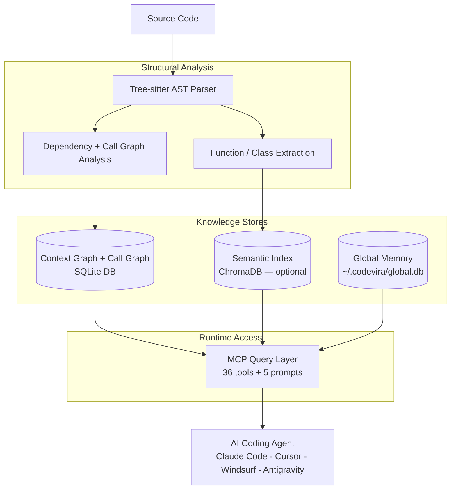

# Codevira

> Persistent adaptive memory for AI coding agents — learns from every session, works with every tool, remembers across every project.

[](https://www.python.org/)
[](LICENSE)
[](https://modelcontextprotocol.io)
[](CHANGELOG.md)
[](CONTRIBUTING.md)

**Works with:** Claude Code · Claude Desktop · Cursor · Windsurf · Google Antigravity · any MCP-compatible AI tool

---

## The Problem

Every time you start a new AI coding session, your agent starts from zero.

It re-reads files it has seen before. It re-discovers patterns already established. It makes decisions that contradict last week's decisions. It has no idea what phase the project is in, what's already been tried, or why certain files are off-limits.

You end up spending thousands of tokens on re-discovery — every single session.

**Codevira fixes this.**

---

## What It Does

Codevira is a [Model Context Protocol](https://modelcontextprotocol.io) server that gives every AI agent working on your codebase a shared, persistent memory:

| Capability | What It Means |
|---|---|
| **Zero-config setup** | Auto-detects language, source dirs, and file extensions; auto-injects IDE config — no prompts, no manual JSON editing |
| **Live auto-watch** | Background file watcher auto-reindexes on every save — no manual trigger needed |
| **Context graph** | Every source file has a node: role, rules, dependencies, stability, `do_not_revert` flags |
| **Function-level call graph** | Knows which function calls which — callers, callees, test coverage, risk scoring |
| **Semantic code search** | Natural language search across your codebase (optional — requires `[search]` extras) |
| **Roadmap** | Phase-based tracker so agents always know what phase you're in and what comes next |
| **Changeset tracking** | Multi-file changes tracked atomically; sessions resume cleanly after interruption |
| **Decision log** | Every session writes a structured log; past decisions are searchable by any future agent |
| **Adaptive learning** | Outcome tracking, confidence scoring, developer preference learning, and automatic rule inference |
| **Cross-project memory** | Learned preferences and rules sync across all your projects via `~/.codevira/global.db` |
| **Cross-tool continuity** | Single "catch me up" call for seamless switching between Cursor, Claude Code, Windsurf, and Antigravity |

**The result:** ~1,400 tokens of overhead per session instead of 15,000+ tokens of re-discovery.

---

## Quick Start

### 1. Install

```bash
# Recommended: global install via pipx (isolated, works everywhere)
pipx install codevira

# Alternative: pip install
pip install codevira

# With semantic search support (adds ChromaDB + sentence-transformers)
pip install 'codevira[search]'
```

### 2. Register with your AI tools

```bash
codevira register
```

This one-time global command injects Codevira's MCP config into all detected AI tools — Claude Code, Cursor, Windsurf, Claude Desktop, and Google Antigravity. Run it from anywhere; no project directory needed.

### 3. Start using

Open any project in your AI tool. On the first MCP tool call, Codevira **auto-initializes**:
- Detects language, source directories, and file extensions from project markers
- Creates the context graph and roadmap
- Installs a `post-commit` git hook for automatic reindexing

No explicit `codevira init` needed — everything happens on demand.

> **Note:** `codevira init` is still available for explicit per-project setup with custom settings.

### 4. Verify

Ask your AI agent to call `get_roadmap()` — it should return your current phase and next action.

> **Note:** Restart your AI tool after running `codevira register` to pick up the new MCP config.

### Manual config (only if auto-inject didn't detect your tool)

Codevira supports two transports. Use the right one for your client:

| Client | Transport | Config file |
|--------|-----------|-------------|
| Claude Desktop (app) | stdio | `~/Library/Application Support/Claude/claude_desktop_config.json` |
| Claude Code (CLI) | stdio or HTTP | `.claude/settings.json` |
| Cursor | stdio | `.cursor/mcp.json` |
| Windsurf | stdio | `.windsurf/mcp.json` |
| Google Antigravity | stdio | `~/.gemini/antigravity/mcp_config.json` |

**Stdio transport** — Claude Desktop, Cursor, Windsurf (`.claude/settings.json` / `.cursor/mcp.json` / `.windsurf/mcp.json`):
```json
{
  "mcpServers": {
    "codevira": {
      "command": "codevira",
      "args": [],
      "cwd": "/path/to/your-project"
    }
  }
}
```

**Claude Desktop** (`~/Library/Application Support/Claude/claude_desktop_config.json`):
```json
{
  "mcpServers": {
    "codevira": {
      "command": "/path/to/codevira",
      "args": ["--project-dir", "/path/to/your-project"]
    }
  }
}
```

> Tip: find the full binary path with `which codevira`

**HTTP transport** — Claude Code CLI via `codevira serve` (`.claude/settings.json`):

First start the HTTP server in a terminal:
```bash
codevira serve --port 7007 --project-dir /path/to/your-project
# For HTTPS (required by some clients):
codevira serve --https --port 7443 --project-dir /path/to/your-project
```

Then register the URL:
```json
{
  "mcpServers": {
    "codevira": {
      "url": "https://localhost:7443/mcp"
    }
  }
}
```

> **HTTPS note:** Claude Code uses Node.js, which requires a trusted CA for HTTPS.
> Run once to trust the mkcert CA:
> ```bash
> brew install mkcert && mkcert -install
> launchctl setenv NODE_EXTRA_CA_CERTS "$(mkcert -CAROOT)/rootCA.pem"
> echo 'export NODE_EXTRA_CA_CERTS="$(mkcert -CAROOT)/rootCA.pem"' >> ~/.zshrc
> ```
> Then restart Claude Code.

**Auto-start on login (macOS):**
```bash
codevira serve --install-service    # start server automatically on login
codevira serve --uninstall-service  # remove auto-start
```

**Google Antigravity** (`~/.gemini/antigravity/mcp_config.json`):
```json
{
  "mcpServers": {
    "codevira": {
      "$typeName": "exa.cascade_plugins_pb.CascadePluginCommandTemplate",
      "command": "codevira",
      "args": []
    }
  }
}
```

### Codevira data layout (v1.6)

```
~/.codevira/                         <- global Codevira home
├── global.db                        <- cross-project intelligence
├── projects/
│   └── <project-key>/               <- per-project data (keyed by path)
│       ├── config.yaml
│       ├── metadata.json
│       ├── graph/
│       │   ├── graph.db
│       │   └── changesets/
│       ├── codeindex/               <- semantic search (optional)
│       └── logs/
└── certs/                           <- HTTPS certs (if using --https)
```

> Legacy `.codevira/` directories inside project repos are auto-migrated to centralized storage on first server start.

### Uninstall / Reset

```bash
codevira clean              # remove global data + IDE configs + launchd service
codevira clean --all        # also remove per-project artifacts
codevira clean --dry-run    # preview what would be removed
```

---

## How It Works

### Agent Session Lifecycle


### Code Intelligence Model



---

## Session Protocol

Every agent session follows a simple protocol. Set it up once in your agent's system prompt — then your agents handle the rest.

**Session start (mandatory):**
```
list_open_changesets()      -> resume any unfinished work first
get_roadmap()               -> current phase, next action
search_decisions("topic")   -> check what's already been decided
get_node("src/service.py")  -> read rules before touching a file
get_impact("src/service.py") -> check blast radius
```

**Session end (mandatory):**
```
complete_changeset(id, decisions=[...])
update_node(file_path, changes)
update_next_action("what the next agent should do")
write_session_log(...)
```

This loop keeps every session fast, focused, and resumable.

---

## 36 MCP Tools + 5 Prompts

### Graph Tools
| Tool | Description |
|---|---|
| `get_node(file_path)` | Metadata, rules, connections, staleness for any file |
| `get_impact(file_path)` | BFS blast-radius — which files depend on this one |
| `list_nodes(layer?, stability?, do_not_revert?)` | Query nodes by attribute |
| `add_node(file_path, role, type, ...)` | Register a new file in the graph |
| `update_node(file_path, changes)` | Append rules, connections, key_functions |
| `refresh_graph(file_paths?)` | Auto-generate stubs for unregistered files |
| `refresh_index(file_paths?)` | Refresh context graph + semantic index (graph-only if chromadb not installed) |
| `export_graph(format, scope?)` | Export dependency graph as Mermaid or DOT diagram |
| `get_graph_diff(base_ref?, head_ref?)` | Show changed nodes, stability flags, and blast radius between git refs |

### Deep Graph Tools (v1.5)
| Tool | Description |
|---|---|
| `query_graph(file_path, symbol?, query_type)` | Function-level: callers, callees, tests, dependents, symbols |
| `analyze_changes(base_ref?, head_ref?)` | Function-level risk scoring with test coverage gaps |
| `find_hotspots(threshold?)` | Large functions, high fan-in, high fan-out — complexity heatmap |

### Roadmap Tools
| Tool | Description |
|---|---|
| `get_roadmap()` | Current phase, next action, open changesets |
| `get_full_roadmap()` | Complete history: all phases, decisions, deferred |
| `get_phase(number)` | Full details of any phase by number |
| `update_next_action(text)` | Set what the next agent should do |
| `update_phase_status(status)` | Mark phase in_progress / blocked |
| `add_phase(phase, name, description, ...)` | Queue new upcoming work |
| `complete_phase(number, key_decisions)` | Mark done, auto-advance to next |
| `defer_phase(number, reason)` | Move a phase to the deferred list |

### Changeset Tools
| Tool | Description |
|---|---|
| `list_open_changesets()` | All in-progress changesets |
| `start_changeset(id, description, files)` | Open a multi-file changeset |
| `complete_changeset(id, decisions)` | Close and record decisions |
| `update_changeset_progress(id, last_file, blocker?)` | Mid-session checkpoint |

### Search Tools
| Tool | Description |
|---|---|
| `search_codebase(query, limit?)` | Semantic search over source code (requires `[search]` extras) |
| `search_decisions(query, limit?, session_id?)` | Search all past session decisions |
| `get_history(file_path)` | All sessions that touched a file |
| `write_session_log(...)` | Write structured session record |

### Adaptive Learning Tools
| Tool | Description |
|---|---|
| `get_decision_confidence(file_path?, pattern?)` | Outcome-based reliability scores |
| `get_preferences(category?)` | Learned developer style preferences |
| `get_learned_rules(file_path?, category?)` | Auto-generated rules from observed patterns |
| `get_project_maturity()` | 0-100 intelligence score |
| `get_session_context()` | Single "catch me up" call for cross-tool continuity |

### Code Reader Tools
| Tool | Description |
|---|---|
| `get_signature(file_path)` | All public symbols, signatures, line numbers (Python, TypeScript, Go, Rust) |
| `get_code(file_path, symbol)` | Full source of one function or class |

### Playbook Tool
| Tool | Description |
|---|---|
| `get_playbook(task_type)` | Curated rules for: `add_tool`, `add_service`, `add_schema`, `debug_pipeline`, `commit`, `write_test` |

### MCP Workflow Prompts (v1.5)
| Prompt | Description |
|---|---|
| `review_changes` | Staged diff + blast radius + risk score |
| `debug_issue` | Symptom -> affected files -> call chain -> hypothesis |
| `onboard_session` | Full project context catch-up for new sessions |
| `pre_commit_check` | Test coverage gaps + high-risk functions before commit |
| `architecture_overview` | Module map + hotspots + dependency summary |

---

## Language Support

| Feature | Python | TypeScript | Go | Rust | 12+ Others |
|---|---|---|---|---|---|
| Context graph + blast radius | Y | Y | Y | Y | Y |
| Semantic code search | Y | Y | Y | Y | Y |
| Function-level call graph | Y | Y | Y | Y | |
| `get_signature` / `get_code` | Y | Y | Y | Y | |
| AST-based chunking | Y | Y | Y | Y | |
| Auto-generated graph stubs | Y | Y | Y | Y | |
| Roadmap + changesets | Y | Y | Y | Y | Y |
| Session logs + decision search | Y | Y | Y | Y | Y |

Supported languages: Python, TypeScript, JavaScript, Go, Rust, Java, Kotlin, C#, Ruby, PHP, C, C++, Swift, Solidity, Vue.

---

## Requirements

- **Python 3.10+**

Base install (`pip install codevira`): includes everything except semantic search. All 36 MCP tools work — graph, roadmap, changesets, code reader, learning, call graph.

With semantic search (`pip install 'codevira[search]'`): adds ChromaDB + sentence-transformers for `search_codebase()`. Downloads a ~90MB embedding model on first use.

---

## Background

Want to understand the full story behind why this was built, the design decisions, what didn't work, and how it compares to other tools in the ecosystem?

Read the full write-up: [How We Cut AI Coding Agent Token Usage by 92%](docs/how-i-built-persistent-memory-for-ai-agents.md)

---

## Contributing

Contributions are welcome. Read [CONTRIBUTING.md](CONTRIBUTING.md) for the full guide.

**Reporting a bug?** [Open a bug report](https://github.com/sachinshelke/codevira/issues/new?template=bug_report.md)
**Requesting a feature?** [Open a feature request](https://github.com/sachinshelke/codevira/issues/new?template=feature_request.md)
**Found a security issue?** Read [SECURITY.md](SECURITY.md) — please don't use public issues for vulnerabilities.

---

## FAQ

Common questions about setup, usage, architecture, and troubleshooting — see [FAQ.md](FAQ.md).

## Roadmap

See what's built, what's next, and the long-term vision — see [ROADMAP.md](ROADMAP.md).

## License

MIT — free to use, modify, and distribute.
